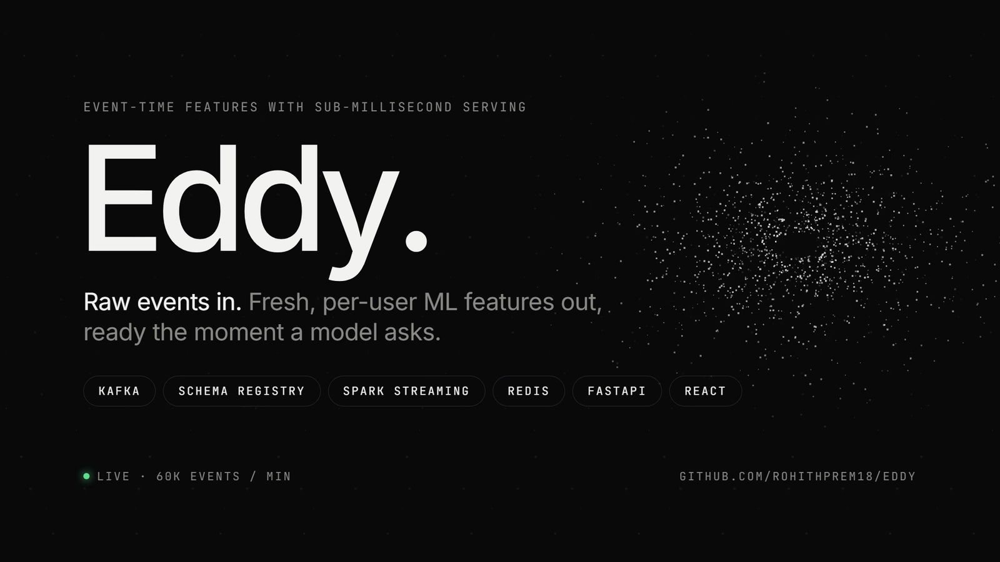
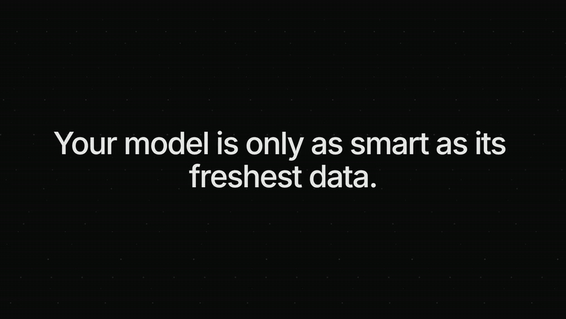
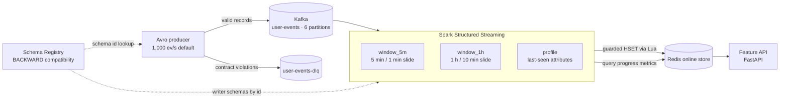

<p align="center">
  
</p>

<p align="center">
  
  
  
  
  
  
</p>

# Eddy

**Event-time features with sub-millisecond serving.** Producers stream user events into Kafka as Avro, with every record checked against a contract in Confluent Schema Registry. Spark Structured Streaming turns the stream into per-user sliding-window features, and a Redis online store serves them in milliseconds through a FastAPI endpoint and a React console. Everything runs with one `docker compose up`.

## ▶ Demo

<p align="center">
  <a href="docs/demo.mp4"></a>
</p>

<p align="center">
  <b><a href="docs/demo.mp4">Watch the 90-second narrated demo (MP4)</a></b><br>
  Voice-over with burned-in subtitles · <a href="docs/demo.srt">caption file (SRT)</a>
</p>

---

## Architecture



### Data contracts
- Avro schemas live in [`schemas/user_event/`](schemas/user_event) as numbered versions. `v2` adds optional `session_id` and `device` fields, which is a BACKWARD-compatible change.
- The **setup** job pins the subject's compatibility level and registers each version in order. It refuses any version the registry reports as incompatible.
- **Producers never auto-register schemas.** They serialise against the newest schema file, which must already be registered, so an unreviewed contract change fails fast. Records that fail serialisation (missing fields, wrong types) are routed to a **dead-letter topic** with the error attached, and the stream keeps running.
- **Consumers read with the exact writer schema.** Spark reads the schema ID from each Confluent wire-format header, decodes with that version's writer schema, and projects the result onto the latest reader schema. v1 and v2 events can coexist on the topic and both decode into one struct.
- **CI gate:** `python -m eddy.compat_check` rejects PRs that add fields without defaults or change field types. `--registry` also asks the live registry.

### Features (per user)

| Feature | 5-minute window | 1-hour window |
|---|---|---|
| Event, view, add-to-cart and purchase counts | `event_count_5m` … | `event_count_1h` … |
| Spend and refund amount | `spend_5m`, `refund_amount_5m` | `spend_1h`, `refund_amount_1h` |
| Average order value, cart→purchase conversion | `avg_order_value_5m`, `cart_conversion_5m` | `…_1h` |
| Distinct products and categories (HyperLogLog) | `distinct_products_5m` … | `…_1h` |
| Freshness | `last_event_ms_5m`, `window_end_ms_5m` | `…_1h` |
| Profile | `last_event_type`, `last_category`, `last_product_id`, `last_device`, `last_seen_ms` | |

### Correctness details
- **Windows come from independent queries.** Each window size is its own streaming query, so for a few seconds one can trail another. Just after startup, the 1-hour and 5-minute windows hold the same events until the stream has run longer than 5 minutes.
- **Event-time windows with watermarks.** Late events are accepted up to `WATERMARK_DELAY` (default 2 min), and state is bounded by the watermark and stored in RocksDB.
- **Trailing-window selection.** Sliding windows overlap, so for each user the job serves the open window that closes soonest, which covers the longest trailing span.
- **No stale overwrites.** A Lua script updates a Redis hash only if the incoming window is at least as new as the stored one, so replays and late micro-batches can't roll features back.
- **Exactly-once source tracking** through Spark checkpoints. Redis writes are idempotent upserts, so a retried batch converges to the same state.
- **Idempotent producer** (`enable.idempotence`, `acks=all`), lz4 compression, keyed by `user_id` for per-user ordering.

## Quick start

**Requirements:** Docker with Compose v2 (Docker Desktop or Rancher Desktop both work) and about 6 GB RAM free.

```bash
git clone https://github.com/rohithprem18/eddy.git
cd eddy
cp .env.example .env
docker compose up -d --build
```

Within a minute or so of startup, features start appearing. Open the **console** at http://localhost:8000. It's a React app with a fixed navbar and four single-screen sections:

| Section | What it answers |
|---|---|
| **Overview** | *Is it working?* Events/min, users with live features, lookup latency, pipeline health, a live throughput chart, and the five-stage data flow with a status per stage. |
| **Pipeline** | *Is Spark keeping up?* Per query: throughput capacity, % of capacity used, the features it produces, state size, batch timings. |
| **Features** | *What does a model see?* Look up any user (suggested and recent ids, `/` to search) and see the 5-minute, 1-hour and profile features, plus a copyable `curl`. |
| **Contracts** | *What must producers send?* Registered schema versions with field-level changes, the compatibility level, and the dead-letter queue with the reason each event was rejected. |

The navbar shows one plain-language health status (Streaming, Starting, Stalled or Offline) so problems are visible from any page. Or use the API directly:

```bash
curl -s localhost:8000/features/u000001 | python -m json.tool
curl -s localhost:8000/stats | python -m json.tool
```

| Service | URL |
|---|---|
| **Console** | http://localhost:8000 |
| Feature API (Swagger UI) | http://localhost:8000/docs |
| Spark UI | http://localhost:4040 |
| Schema Registry | http://localhost:8085/subjects |
| Kafka UI (optional) | `make ui`, then http://localhost:8090 |
| Kafka (from host) | `localhost:29092` |

### Feature API

| Method | Path | Description |
|---|---|---|
| `GET` | `/features/{user_id}` | Feature vector, plus freshness and lookup latency |
| `POST` | `/features/batch` | Up to 1,000 users in a single pipelined Redis round trip |
| `GET` | `/stats` | Events/min and per-query Spark throughput, plus store size |
| `GET` | `/users/sample?n=8` | A few user ids that currently have features |
| `GET` | `/contracts` | Registered schema versions, field-level changes, compatibility level |
| `GET` | `/dlq?limit=8` | Dead-letter count and the latest rejected events with their errors |
| `GET` | `/health` | Liveness (checks Redis) |

### Benchmark

```bash
make bench
```

This measures three things over a live 60-second window:
- **Ingest rate:** growth of Kafka's end offsets, in events per minute.
- **Processing rate:** Spark's `processedRowsPerSecond` for each query.
- **Serving latency:** p50/p95/p99 over 2,000 random feature lookups.

The default producer rate is 1,000 events/s (60,000/min). Raise `EVENTS_PER_SECOND` in `.env` to push harder, or run more producers with `docker compose up -d --scale producer=3`.

### Try the contract enforcement

```bash
make dlq       # see malformed events captured with their serialisation error
make compat    # contract gate against the live registry
```

To see a breaking change blocked, add `schemas/user_event/v3.avsc` with a new field that has no default, then run `python -m eddy.compat_check`. It exits non-zero, and CI fails the PR.

## Project layout

```
eddy/
├── eddy/                    # Python package
│   ├── config.py            # env-driven settings
│   ├── events.py            # synthetic clickstream (Zipf-skewed users, funnel ratios)
│   ├── producer.py          # Avro producer + dead-letter routing
│   ├── setup_infra.py       # topics, compatibility level, schema registration
│   ├── schema_registry.py   # registry REST client + offline compatibility lint
│   ├── compat_check.py      # CI contract gate
│   ├── features.py          # Spark transforms: wire-format decode, windows, profile
│   ├── online_store.py      # guarded Redis writer
│   ├── api.py               # FastAPI feature-serving API
│   └── bench.py             # throughput + latency benchmark
├── spark/feature_job.py     # streaming job entry point (3 queries)
├── web/                     # React + Vite console (built into the feature-API image)
├── schemas/user_event/      # versioned Avro contracts
├── docker/                  # app + Spark images (connectors baked in)
├── tests/                   # unit, Spark, Redis/Lua and API tests
└── docker-compose.yml
```

## Configuration

See [.env.example](.env.example). Key settings: `EVENTS_PER_SECOND`, `INVALID_EVENT_RATE`, `TOPIC_PARTITIONS`, `TRIGGER_INTERVAL`, `WATERMARK_DELAY`, `FEATURE_TTL_SECONDS`.

## Development

```bash
python -m venv .venv && source .venv/bin/activate
pip install -r requirements-dev.txt     # needs Java 17 for the Spark tests
python -m eddy.compat_check && pytest -q && ruff check .
```

CI runs lint, the schema gate and all tests. It then starts the full Docker stack and checks end to end that streamed features reach Redis and are served by the API.

## License

MIT
